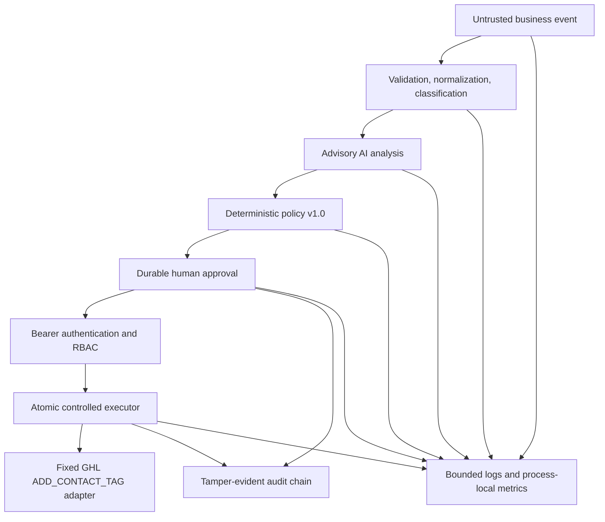

# AI-Powered Business Automation & Intelligent Operations Platform

A security-first reference platform for turning bounded business events into advisory AI insight,
deterministic policy decisions, durable human approvals, and one narrowly controlled CRM action.
The project demonstrates how to place explicit trust boundaries around AI-assisted operations:
models advise, deterministic code decides, authenticated humans approve, and a fixed executor may
perform only the action committed to the approval record.

> AI is advisory only. It cannot select tools, authorize work, or execute business actions.
>
> The only external business mutation is `ADD_CONTACT_TAG` through one fixed GHL endpoint.

## Problem

Business automation often combines untrusted event data, probabilistic model output, privileged
credentials, and irreversible external side effects. Without explicit boundaries, prompt content,
client-supplied identity, retries, or generic integration code can become unintended authority.
This project separates those concerns and makes each transition validated, attributable,
single-purpose, and testable.

## Architecture



The control flow is deliberately asymmetric: AI output can influence policy input, but it cannot
cross the approval, authorization, or execution boundaries by itself. See
[Architecture](docs/architecture.md), [Security](docs/security.md), and
[Deployment](docs/deployment.md) for the detailed contracts.

## Key capabilities

- **Secure event ingestion:** strict envelopes, closed event/source taxonomies, recursive payload
  bounds, a 16 KiB default request ceiling, server-generated identity, and safe acknowledgements.
- **Deterministic normalization:** UTC timestamps, deep-copied payloads, deterministic categories,
  and bounded canonical JSON.
- **AI business intelligence:** one isolated OpenAI Responses adapter with a server-owned model,
  strict structured output, bounded input/output, no tools, storage disabled, and no retries.
- **Deterministic policy:** pure versioned rules with closed decisions, actions, risk levels, and
  evidence. `ALLOW` is never an execution command.
- **Human approval:** transactional SQLite lifecycle records, expiry, provenance commitments, and
  hash-linked audit events.
- **Authentication and RBAC:** strict Bearer parsing, constant-time comparison of every configured
  credential slot, server-derived actors/roles, and closed role permissions.
- **Controlled GHL execution:** one atomic, single-use `ADD_CONTACT_TAG` claim bound to approved
  contact/tag provenance and a fixed provider request.
- **Audit and observability:** approval/execution/security audit records, allowlisted JSON logs,
  recursive redaction, request IDs, fixed counters, and aggregate latency.
- **Production hardening:** fail-closed production settings, pinned runtime dependencies, non-root
  container configuration, local readiness, and static release verification.

## Trust and execution safety

The client cannot provide policy results, approver identity, executor identity, action names,
provider origins, URLs, HTTP methods, headers, credentials, model names, database paths, or retry
behavior. Authenticated actor identity and role come only from server-configured credential slots.

Execution requires an unexpired `APPROVED` record whose provenance and audit chain verify. SQLite
uses `BEGIN IMMEDIATE`, a unique execution-per-approval constraint, and a conditional claim so a
second or concurrent attempt cannot claim the same approval. Terminal states are `SUCCEEDED`,
`FAILED`, and `UNKNOWN`. `UNKNOWN` means the external outcome cannot be established and is never
automatically retried or replayed.

GHL networking is isolated to one adapter using:

- Origin: `https://services.leadconnectorhq.com`
- Method/path: `POST /contacts/{contactId}/tags`
- Version header: `v3`
- Body: `{"tags": ["<approved-tag>"]}`

There is no generic HTTP interface, configurable provider origin, arbitrary URL, workflow engine,
n8n integration, background worker, autonomous agent, or AI-directed execution path.

## Authentication and roles

Protected endpoints require `Authorization: Bearer <server-configured-token>`. Roles inherit only
the following permissions:

| Role | Read | AI analysis/policy | Approve/reject | Execute | Admin status |
| --- | ---: | ---: | ---: | ---: | ---: |
| `READ_ONLY` | Yes | Yes | No | No | No |
| `APPROVER` | Yes | Yes | Yes | No | No |
| `EXECUTOR` | Yes | Yes | No | Yes | No |
| `ADMIN` | Yes | Yes | Yes | Yes | Yes |

Authentication failures and protected mutations use fixed-memory, process-local rate-limit
counters. These controls reset on restart and do not replace perimeter rate limiting.

## API overview

All protected responses include `Cache-Control: no-store` and `Pragma: no-cache`; all responses
include `X-Content-Type-Options: nosniff`. CORS is disabled.

| Method | Path | Access | Safe behavior |
| --- | --- | --- | --- |
| `GET` | `/health` | Public | Constant liveness; no database or provider access |
| `GET` | `/ready` | Public | Bounded local SQLite readiness only |
| `GET` | `/api/v1/admin/status` | `ADMIN` | Closed status, policy/action metadata, readiness, and aggregate metrics |
| `POST` | `/api/v1/events` | Public | Validate, normalize, classify, and return a safe acknowledgement |
| `POST` | `/api/v1/events/analyze` | Any configured role | Return validated advisory intelligence |
| `POST` | `/api/v1/events/decide` | Any configured role | Return deterministic policy output; never execute |
| `POST` | `/api/v1/approvals` | `APPROVER`, `ADMIN` | Recompute intelligence/policy and create a pending approval when required |
| `GET` | `/api/v1/approvals/{approval_id}` | Any configured role | Return bounded approval metadata and persist expiry when due |
| `POST` | `/api/v1/approvals/{approval_id}/approve` | `APPROVER`, `ADMIN` | Record the authenticated actor on a valid pending transition |
| `POST` | `/api/v1/approvals/{approval_id}/reject` | `APPROVER`, `ADMIN` | Record a bounded safe rejection and authenticated actor |
| `POST` | `/api/v1/actions/contact-tag` | `EXECUTOR`, `ADMIN` | Atomically claim and perform the one approval-bound GHL mutation |
| `GET` | `/api/v1/actions/executions/{execution_id}` | Any configured role | Return execution ID, action, and closed status only |

Request and response schemas are also available from FastAPI's generated OpenAPI document when the
application is running. They intentionally exclude credentials and internal filesystem details.

## Technology stack

- Python 3.12
- FastAPI and Pydantic v2 / pydantic-settings
- SQLite with foreign keys, WAL, busy timeout, and explicit transactions
- Official OpenAI Python SDK at the isolated AI boundary
- HTTPX only inside the dedicated GHL adapter
- pytest/pytest-cov, Ruff, mypy, and pip-audit
- Docker using pinned `python:3.12.10-slim-bookworm`

Runtime versions used by the container are exactly pinned in `requirements.lock`. Project metadata
remains version `0.1.0`; no release tag or package publication is implied.

## Project structure

```text
.
├── src/ai_business_automation/
│   ├── api/             # Routes and safe public errors
│   ├── config/          # Server-owned validated settings
│   ├── logging/         # Request context, JSON logs, and redaction
│   ├── models/          # Strict domain and API schemas
│   ├── providers/       # Isolated OpenAI and fixed GHL adapters
│   ├── repositories/    # Transactional SQLite persistence
│   ├── security/        # Bearer authentication, RBAC, limits, headers
│   └── services/        # Ingestion, policy, approval, execution, metrics
├── tests/               # Unit, integration, security, and regression tests
├── docs/                # Architecture, security, and deployment guidance
├── scripts/             # Source security scan and release verifier
├── Dockerfile
├── requirements.lock
└── pyproject.toml
```

## Configuration

Settings are server-owned `APP_` environment variables. `.env.example` contains non-secret local
defaults only. Important settings include:

| Setting | Purpose |
| --- | --- |
| `APP_ENVIRONMENT` | `development`, `test`, or `production` |
| `APP_DEBUG`, `APP_LOG_LEVEL` | Runtime diagnostics; production rejects debug/`DEBUG` |
| `APP_APPROVAL_DATABASE_PATH` | Validated relative SQLite path |
| `APP_APPROVAL_TTL_SECONDS` | Approval expiry, default 1,800 seconds |
| `APP_AUTH_TOKEN_n`, `APP_AUTH_ACTOR_n`, `APP_AUTH_ROLE_n` | Up to three complete credential slots |
| `APP_OPENAI_API_KEY`, `APP_OPENAI_MODEL` | AI credential and server-owned allowlisted model |
| `APP_GHL_API_KEY`, `APP_GHL_API_VERSION` | GHL credential and fixed `v3` version |
| `APP_POLICY_CONFIDENCE_THRESHOLD` | Server-owned deterministic policy threshold |

Production additionally requires strong non-placeholder credentials, an explicit database path
with an existing trusted parent, a non-development approver label, an allowlisted model, and safe
policy configuration. Secrets use `SecretStr` and are injected at runtime, never committed.

## Local development

```bash
python -m venv .venv
python -m pip install --upgrade pip
python -m pip install -e ".[dev]"
python -m uvicorn ai_business_automation.main:app
```

Development defaults do not include provider or authentication credentials. Provider-backed and
protected operations fail closed until their server-owned configuration is supplied. Tests use
fake credentials and mocked providers; they never make real GHL or OpenAI requests.

## Testing and security verification

```bash
python -m pytest --cov
python -m ruff check .
python -m ruff format --check .
python -m mypy
python -m pip_audit .
python scripts/security_scan.py
python scripts/verify_release.py
```

Coverage must remain at or above 95%. GitHub Actions runs every command above on pushes and pull
requests targeting `main`; no badge is shown because no stable public badge URL is configured.

The release verifier performs bounded static checks for container hardening, exact runtime pins,
ignored artifacts, obvious secret patterns, the fixed provider origin/action, security headers,
AI tool isolation, and production settings. It does not contact providers or mutate persistence.

## Docker deployment

The image installs only the pinned runtime lock, copies application source, runs one Uvicorn worker
as UID/GID `10001:10001`, exposes port 8000, disables access/server headers, and health-checks only
`/health`. Mount a persistent writable volume at `/app/data` and inject production settings through
the deployment platform's secret manager. See [Deployment](docs/deployment.md).

Static Docker checks are part of release verification. A live build, runtime UID inspection, and
healthcheck require a Docker-enabled environment and must not be inferred from static checks.

## Production limitations

- SQLite, metrics, and rate limits are process-local.
- The supported deployment is one process, one worker, and one application instance.
- Horizontal SQLite deployment and multi-replica coordination are not supported.
- Business events and raw AI content are not durably stored.
- Metrics are not distributed, durable, exported, or a real-time monitoring system.
- There is no background queue, scheduler, workflow engine, reconciliation process, or automatic
  retry/replay mechanism.
- Provider delivery cannot be proven after an ambiguous transport failure; the record becomes
  terminal `UNKNOWN` for manual investigation.
- Static bearer credentials are not an external identity provider or user-management system.
- The SHA-256 audit chain is application-level tamper evidence, not an immutable external ledger.

## Future improvements

Potential future work requires separate architecture and threat review: external identity and key
rotation, a durable multi-instance database, distributed coordination/rate limiting/metrics,
operator-reviewed `UNKNOWN` reconciliation, encrypted backup automation, and external monitoring.
None of these capabilities is implemented in this release.

## License

No license has been intentionally selected for this repository. Do not assume reuse rights without
permission from the repository owner.
