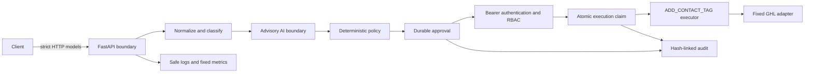

# Architecture

## System shape

The platform is a single-process Python 3.12 application whose boundaries separate untrusted
events, advisory AI, deterministic authority, human authorization, and external side effects.

| Package | Responsibility |
| --- | --- |
| `api/` | HTTP routes and stable public error contracts |
| `config/` | Strict server-owned environment settings |
| `logging/` | Async request context, bounded JSON logging, and redaction |
| `models/` | Strict immutable domain and API schemas |
| `providers/` | Isolated OpenAI analysis and one-operation GHL adapters |
| `repositories/` | Transactional SQLite approval, execution, and security-audit persistence |
| `security/` | Bearer authentication, RBAC, rate limiting, request limits, and headers |
| `services/` | Ingestion, analysis, policy, approval, execution, readiness, and metrics |

## Trust boundaries

### Event boundary

HTTP middleware assigns a random authoritative request ID and enforces the configured body limit
before FastAPI parsing. Strict Pydantic models reject unknown fields and bound the event envelope,
payload depth, nodes, field names, arrays, strings, numbers, timestamps, URL-like content,
credential-like keys, and command-like content.

Normalization converts timestamps to UTC, applies age/skew rules, deep-copies the payload, creates
server identity and receipt time, and maps the closed event taxonomy to a closed category. Compact,
sorted UTF-8 canonical JSON is bounded to 8 KiB. Event ingestion returns a safe acknowledgement;
there is no business-event repository, queue, scheduler, or background processor.

### AI boundary

`BusinessIntelligenceService` depends on a provider-neutral protocol. The OpenAI adapter is the
only OpenAI SDK boundary. It receives a bounded allowlist of the canonical event and uses a
server-owned model, fixed instruction, timeout, zero retries, strict JSON-schema output, storage
disabled, and no tools. Output is treated as untrusted and revalidated into closed enums and
bounded text before use.

AI cannot access credentials, policy authority, approval state, the executor, GHL, arbitrary URLs,
or a tool framework. Provider failure stops the operation with a safe category.

### Policy boundary

The version `1.0` deterministic policy engine is pure: it reads only the validated canonical event
and validated intelligence result. It owns its confidence threshold, rule precedence, closed
decisions, recommended actions, risk values, and evidence codes. It performs no I/O and does not
read headers, configuration secrets, time, randomness, or network state.

Results are `ALLOW`, `REQUIRE_HUMAN_APPROVAL`, or `DENY`. `ALLOW` describes policy only and grants
no execution authority. The GHL action path is available only when policy requires a human approval
for a validated internal `GHL_CONTACT_TAG_REQUEST`.

### Approval boundary

Approval creation recomputes normalization, AI analysis, and policy; clients cannot submit policy
or provenance. Only `REQUIRE_HUMAN_APPROVAL` creates `PENDING`. The record owns server-generated
identity, timestamps, TTL, decision/action/risk/evidence, and digest commitments to canonical event
and intelligence inputs.

The lifecycle is `PENDING -> APPROVED | REJECTED | EXPIRED`; terminal states do not transition.
SQLite transactions use `BEGIN IMMEDIATE` and conditional updates. Reads persist expiry when due.
The authenticated actor, not a request field, is recorded on approve/reject.

### Authentication and authorization boundary

Protected routes accept exactly one strict Bearer header. Every configured credential slot is
compared with `hmac.compare_digest` before a match is selected. Token, actor, and role slots must be
complete; actors and roles are server-configured and cannot be overridden by a body or header.

The closed roles are `READ_ONLY`, `APPROVER`, `EXECUTOR`, and `ADMIN`. All roles may read and use
analysis/policy. Approval mutation requires `APPROVER` or `ADMIN`; execution requires `EXECUTOR` or
`ADMIN`; administrative status requires `ADMIN`. Authentication failures and mutations use two
fixed-size process-local rate-limit buckets.

### Execution boundary

The execution request contains only an approval ID, bounded contact ID, and one bounded tag. The
repository reloads and verifies approval status, expiry, provenance, policy version, and audit
integrity, then requires the requested contact/tag to equal the approval commitment.

Claiming runs in one `BEGIN IMMEDIATE` transaction. A unique approval reference and conditional
`PENDING -> CLAIMED` update prevent duplicate/concurrent claims. The only executor exposes
`ADD_CONTACT_TAG`; there is no action registry, dynamic import, provider selector, generic request
method, arbitrary URL, or client-selected retry.

The lifecycle is `PENDING -> CLAIMED -> SUCCEEDED | FAILED | UNKNOWN`. `FAILED` is a definite
failure. `UNKNOWN` means provider completion cannot be established. Both are terminal; neither is
automatically retried or replayed.

### Provider boundary

`httpx` is confined to the GHL adapter. The adapter owns the exact origin
`https://services.leadconnectorhq.com`, constructs only
`POST /contacts/{contactId}/tags`, supplies the server credential and `Version: v3`, disables
redirect following, bounds timeout/response size, and sends only `{"tags": [tag]}`. Raw provider
bodies and exception details do not leave the adapter.

### Audit boundary

Approval and execution events extend a canonical SHA-256 chain committed by count and head hash on
the approval record. Security authentication/authorization events use a separate persistent
hash-linked chain. Audit fields are closed and omit tokens, headers, event payloads, AI content,
provider responses, contact IDs, and tags.

The chains provide application-level tamper evidence, not database immutability. An attacker able
to rewrite all records and recompute the complete unkeyed chain is outside this guarantee.

### Observability boundary

Request context contains only the server request ID and, after authentication, server-derived actor
ID/role. Logs use a fixed field allowlist, bounded recursive redaction, bounded scalar/container
sizes, and a 4 KiB final record limit. They exclude bodies, customer text, prompts, raw provider
data, credentials, paths, arbitrary URLs, and stack traces.

Metrics are a fixed enum of saturating counters plus aggregate request latency with no labels or
per-request history. They are process-local, reset on restart, and never participate in policy,
authorization, approval, or execution.

### Deployment boundary

Production settings fail closed on missing/weak/placeholder credentials, debug configuration,
`DEBUG` logging, unapproved models, unsafe policy values, development fallback identity, and unsafe
SQLite configuration. The relative database parent must already exist. Startup validates local
persistence without provider calls; operation-scoped SQLite connections close deterministically.

The container pins Python and runtime packages, copies only source, runs one Uvicorn worker as
UID/GID `10001:10001`, and health-checks `/health`. Static release checks verify the Docker,
configuration, origin/action, security-header, secret, artifact, and dependency-pin constraints
without network access or database mutation.

## Deliberate limitations

SQLite persistence, metrics, and rate limiting are process-local. The production baseline is one
process, one worker, and one application instance. There is no horizontal SQLite design,
distributed lock, durable event queue, scheduler, background worker, automatic retry/replay,
workflow engine, n8n integration, autonomous agent, generic CRM layer, or real-time monitoring
backend.
